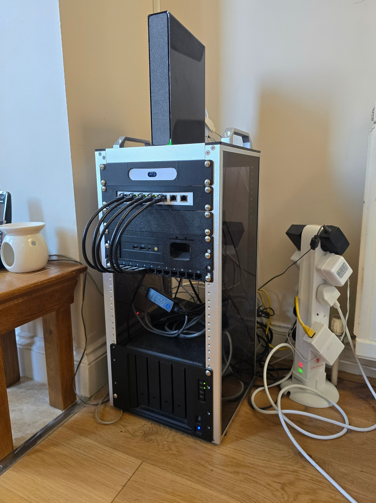

# 🖥️ Homelab
 
> A self-hosted infrastructure stack built for media, communication, AI inference, and game server hosting. Running on consumer and prosumer hardware with enterprise-adjacent practices.


 

 
---
 
## Table of Contents
 
- [Overview](#overview)
- [Network Topology](#network-topology)
  - [Network Diagram](#network-diagram)
- [Hardware](#hardware)
- [Proxmox Virtualisation Host](#proxmox-virtualisation-host)
- [Virtual Machines](#virtual-machines)
  - [Ampitheatre — Media Server](#ampitheatre--media-server)
  - [Pygmachia — Game Server Host](#pygmachia--game-server-host)
  - [The-Agora — Communications](#the-agora--communications)
- [Obsidian Tower — Local AI Server](#obsidian-tower--local-ai-server)
- [Storage](#storage)
- [Access & Security Model](#access--security-model)
- [Physical Build](#physical-build)
- [Troubleshooting & Problem Solving](#troubleshooting--problem-solving)
- [Future Plans](#future-plans)
 
---
 
## Overview
 
This homelab is a fully self-hosted environment designed around privacy, control, and learning. It handles:
 
- **Media delivery** — Plex media server with supporting management tooling
- **Game server hosting** — Multi-game server management via Pterodactyl
- **Communications** — Federated messaging via Matrix Synapse
- **Local AI inference** — LLM and generative art serving via Ollama and ComfyUI
- **Network-level ad blocking** — DNS-based filtering via Pi-hole
 
All public-facing services operate under a personal domain, with access controlled through a combination of Cloudflare Zero Trust, Nginx reverse proxies, and Let's Encrypt SSL certificates.
 
---
 
## Network Topology
 
```
Internet
    │
    ▼
Virgin Media Hub 5 (Modem Mode)
    │
    ▼
Ubiquiti Gateway Ultra
    │
    ▼
Ubiquiti Switch Ultra 210W
    ├── Intel NUC (Proxmox Host)
    ├── Synology DS920+ NAS
    ├── Raspberry Pi 4 (Pi-hole DNS)
    └── NETGEAR R8000 Nighthawk X6 (Access Point Mode)
            └── Obsidian Tower / Custom Desktop (Ethernet)
```
 
**Key network decisions:**
 
- The Virgin Hub 5 operates in **modem mode**, handing full routing responsibilities to the Ubiquiti Gateway Ultra
- The NETGEAR R8000 operates as a **pure access point** — routing and DHCP are handled upstream by the Ubiquiti gateway
- Pi-hole acts as the **primary DNS resolver** for the network, providing ad blocking and local DNS record management
- VLANs are not currently implemented as the network is shared with other users on premises; network segmentation has been consciously deferred to avoid interference with devices outside my control
 
---
 
## Network Diagram
 
> [View interactive network diagram](./network/network-diagram.md)
 
---
 
## Hardware
 
| Device | Role | Key Specs |
|---|---|---|
| Ubiquiti Gateway Ultra | Router / Firewall | — |
| Ubiquiti Switch Ultra 210W | Managed PoE Switch | 210W PoE budget |
| Intel NUC13ANHI7 | Proxmox Hypervisor | i7-1360P / 64GB DDR4 (upgraded) / 1TB SSD + 256GB NVMe |
| Raspberry Pi 2B | DNS / Network Services | Pi-hole — PoE powered from Ubiquiti switch (recently added, not yet racked) |
| Synology DS920+ | NAS / Media Storage | 2× 16TB in Synology Hybrid RAID (SHR) |
| NETGEAR R8000 Nighthawk X6 | Wireless Access Point | AC3200 Tri-Band |
| Obsidian Tower (Custom Desktop PC) | Local AI Inference | Connected via ethernet through Netgear AP — see [below](#obsidian-tower--local-ai-server) |
 
> **Note on NUC upgrade:** The NUC13ANHI7 shipped with 32GB DDR4. RAM was upgraded to 64GB DDR4 and an additional 256GB NVMe was installed to expand VM storage capacity.
 
---
 
## Proxmox Virtualisation Host
 
**Host:** Intel NUC13ANHI7
**Hypervisor:** Proxmox VE
 
The NUC runs three Ubuntu Server VMs, each provisioned for a specific workload. All VM containers are managed internally using either **Portainer** or **Dockhand** depending on the VM. Docker is the primary container runtime across all VMs.
 
| VM | RAM | vCPUs | Storage | Primary Role |
|---|---|---|---|---|
| Ampitheatre | 20GB | 4 cores / 1 socket | 132GB | Media server |
| Pygmachia | 32GB | 6 cores / 1 socket | 250GB | Game servers |
| The-Agora | 8GB | 4 cores / 1 socket | 300GB | Communications |
 
---
 
## Virtual Machines
 
### Ampitheatre — Media Server
 
**OS:** Ubuntu Server
**Container Management:** Portainer
**NFS Mount:** DS920+ NAS (media library and book library served over NFS)
 
**Stack:**
 
| Service | Purpose |
|---|---|
| Plex Media Server | Media streaming |
| Media management tooling | Library and metadata management (internal only) |
| Calibre-Web | E-book library and reader |
 
**Access model:**
- **Plex** — Externally accessible via Plex relay
- **Calibre-Web** — Cloudflare Zero Trust tunnel with email policy enforced
- **Internal management tools & Portainer** — Internal only, accessible via Pi-hole local DNS records and Nginx reverse proxy with Let's Encrypt SSL
 
> Movie and book files reside on the NAS and are accessed by Ampitheatre via NFS mount, keeping large media files off the Proxmox host entirely.
 
---
 
### Pygmachia — Game Server Host
 
**OS:** Ubuntu Server
**Container Management:** Portainer
 
**Stack:**
 
| Service | Purpose |
|---|---|
| Pterodactyl Panel | Web-based game server management |
| Pterodactyl Wings | Game server daemon/runtime |
| Nginx + Let's Encrypt | Reverse proxy and SSL for panel and game servers |
 
**Access model:**
- Pterodactyl panel is externally accessible via Nginx reverse proxy with Let's Encrypt SSL
- Individual game servers are accessible externally on their required ports
- All SSL and reverse proxy configuration managed directly via Nginx
 
---
 
### The-Agora — Communications
 
**OS:** Ubuntu Server
**Container Management:** Dockhand *(currently evaluating as an alternative to Portainer)*
 
**Stack:**
 
| Service | Purpose |
|---|---|
| Matrix Synapse | Federated messaging server |
| PostgreSQL 15 | Database backend for Synapse |
| Cloudflare Tunnel | External access without open ports |
| Cloudflare Realtime TURN | WebRTC relay for voice/video calls |
| matrix-turnify | Bridges Cloudflare Realtime TURN credentials into Synapse |
| synapse-admin | Web dashboard for server administration (internal only) |
| mautrix-discord | Discord bridge — mirrors Discord channels into Matrix rooms |
 
**Access model:**
- Matrix Synapse is exposed externally via **Cloudflare Tunnel**, removing the need to open ports on the firewall
- **Cloudflare Realtime** handles WebRTC TURN relay for voice and video calls via matrix-turnify
- Federation is handled via a **Cloudflare Worker** serving `.well-known/matrix/server` and `.well-known/matrix/client` on port 443
- Element Call (MatrixRTC) enabled via `rtc_foci` block in the Cloudflare Worker response
- synapse-admin is internal only
- Future: personal website to be hosted on this VM
 
> Full setup guide including all phases of configuration, troubleshooting, and the Discord bridge: [matrix-server-guide.md](./services/the-agora/matrix-server-guide.md)
 
---
 
## Obsidian Tower — Local AI Server
 
**Hostname:** `obsidian-tower`
**OS:** Ubuntu 24.04 LTS (Noble Numbat)
**Container Management:** Portainer (Docker)
 
### Hardware
 
| Component | Detail |
|---|---|
| GPU 1 | NVIDIA GeForce RTX 3080 — 10GB VRAM (LLM inference) |
| GPU 2 | NVIDIA GeForce GTX 1070 Ti — 8GB VRAM (Generative art) |
| CUDA Support | Multi-GPU CUDA configuration on Ubuntu 24.04 LTS |
| Storage | M.2 NVMe SSD (OS + application data directories) |
 
> The two GPUs are dedicated to separate workloads. The RTX 3080 handles LLM inference exclusively; the GTX 1070 Ti is dedicated to ComfyUI generative art pipelines. This prevents VRAM contention between the two workloads.
 
### Stack
 
| Service | Purpose |
|---|---|
| Ollama | Local LLM runtime |
| Open WebUI | Browser-based chat interface for LLMs |
| SearXNG | Self-hosted meta search engine (used by Open WebUI for web-augmented queries) |
| ComfyUI | Node-based generative art / Stable Diffusion interface |
 
### Models Running
 
| Model | Runtime | Purpose |
|---|---|---|
| DeepSeek-R1-14B | Ollama | General reasoning and chat |
| Qwen2.5-Coder-7B | Ollama | Code assistance |
 
---
 
## Storage
 
**Primary NAS:** Synology DS920+
 
| Detail | Value |
|---|---|
| Drives | 2× 16TB |
| RAID Configuration | Synology Hybrid RAID (SHR) |
| External Access | Remote access configured |
| Services hosted | Media library (Plex), Book library (Calibre-Web), Synology Photos |
The NAS is mounted over NFS to Ampitheatre for media access, keeping large files off the Proxmox host and centralising storage management.
 
**Backup:**
- Crucial X10 Pro 2TB External SSD used for local backup of important documents and photographs
 
---
 
## Access & Security Model
 
| Access Type | Method | Services |
|---|---|---|
| External — zero trust | Cloudflare Tunnel + email policy | Calibre-Web, Matrix Synapse |
| External — port forward | Direct + Plex relay | Plex Media Server |
| External — reverse proxy | Nginx + Let's Encrypt SSL | Pterodactyl panel & game servers |
| Internal only | Pi-hole local DNS + Nginx + Let's Encrypt | Internal management tools, Portainer instances |
| NAS remote access | Remote access configured | Synology Photos, DS920+ management |
 
All external services operate under a personal domain. Internal services use the same domain structure but are resolved locally via Pi-hole custom DNS records and are not publicly reachable.
 
---
 
## Physical Build
 
The homelab is housed in a **DeskPi rack**, with custom 3D printed mounting trays designed and printed to fit each device precisely. All racked devices are trayed rather than stacked ad hoc, giving the build a structured and maintainable layout.
 
The Raspberry Pi 2B is the most recent addition and is currently powered via PoE from the Ubiquiti Switch Ultra — a custom rack tray is planned once the setup is finalised.
 
---
 
## Troubleshooting & Problem Solving
 
Real issues encountered during the build and operation of this lab. Documented here as a record of diagnosis and resolution.
 
---
 
### ✅ Matrix Synapse — Green Flicker on Screen Share / Webcam
 
**Symptoms:** Users connecting from within the local network experienced a green flickering artefact when screen sharing or using a webcam during calls. Users connecting externally via Cloudflare Realtime did not experience the issue.
 
**Diagnosis:** The root cause was a missing MatrixRTC focus configuration. Without an `rtc_foci` block in the `.well-known/matrix/client` response, clients were not being directed to use the Cloudflare Realtime TURN relay for local WebRTC paths, causing them to fall back to a broken direct peer connection.
 
**Resolution:** Resolved as part of enabling Element Call (Phase 9 of the Matrix server setup). The Cloudflare Worker serving `.well-known/matrix/client` was updated to include the `rtc_foci` block pointing to the LiveKit service URL. Once the Cloudflare cache was purged and Element's local cache cleared, all calls — both local and external — routed correctly through the TURN relay.
 
**Outcome:** Green flicker resolved on both local network and external connections. Screen sharing and webcam now work correctly for all users.
 
> See [matrix-server-guide.md](./services/the-agora/matrix-server-guide.md) Phase 9 for full resolution steps.
 
---
 
### ✅ Matrix Synapse — MISSING_MATRIX_RTC_FOCUS Error (Element Call Not Working)

**Symptoms:** Attempting to start a call in a Matrix client returns:
- `Call is not supported — The server is not configured to work with Element Call`
- Error code: `MISSING_MATRIX_RTC_FOCUS`

**Diagnosis:** Newer Matrix clients (Element, Commet) require the server to advertise a MatrixRTC focus server via the `org.matrix.msc4143.rtc_foci` block in the `.well-known/matrix/client` response. Without this, clients do not know where to route calls and refuse to connect.

Because the setup uses a **Cloudflare Worker** to serve federation endpoints, editing `homeserver.yaml` alone has no effect — the Worker intercepts `.well-known` requests before they reach Synapse.

**Resolution:**
Updated the Cloudflare Worker script to include the `rtc_foci` block in the `.well-known/matrix/client` response, pointing to `https://jwt.call.element.io` as the LiveKit service URL. Then purged the Cloudflare cache for the `.well-known/matrix/client` URL to force the change to propagate immediately.

After server-side fix, Element's local cache also required clearing — the in-app clear cache button was insufficient, requiring manual deletion of the Element app data folder.

**Outcome:** Element Call and MatrixRTC voice/video calls working correctly. This fix also resolved the pre-existing green screen flicker issue on local network calls.

> See [matrix-server-guide.md](./services/the-agora/matrix-server-guide.md) Phase 9 for full resolution steps.

---

### ✅ Pterodactyl — SSL Auto-Renewal Not Covered by Setup Script
 
**Symptoms:** The community setup script for Pterodactyl configured Nginx and Let's Encrypt correctly for initial deployment but did not include automatic SSL certificate renewal, which would cause certificates to expire without intervention.
 
**Resolution:** Modified the setup script to include a cron job for automatic Let's Encrypt certificate renewal via `certbot renew`. Tested renewal process to confirm it runs without interrupting active game server connections.
 
**Outcome:** Certificates now renew automatically. No manual intervention required.
 
---
 
### ✅ Discord to Matrix Migration — Chat Import Stalling on Checkpoint Posts
 
**Symptoms:** When migrating a Discord server's chat history to Matrix Synapse, the import process stalled and failed to download and insert messages. The failure was not consistent across all channels — it specifically affected a general chat channel containing end-of-year checkpoint posts.
 
**Diagnosis:** Isolated the failure to specific posts within the channel. The checkpoint posts (likely due to their formatting, size, or embedded content) were causing the importer to fail silently without progressing past those messages.
 
**Resolution:** Identified and deleted the specific problematic posts from Discord prior to re-running the import. Migration completed successfully after removal.
 
**Outcome:** Full chat history migrated to Matrix Synapse. A targeted deletion of edge-case content was the most pragmatic resolution given the importer's lack of error handling for malformed messages.

 
---
 
### ✅ Calibre-Web — 500 Internal Server Error on Launch (Missing Database Columns)
 
**Symptoms:** Calibre-Web throwing a 500 Internal Server Error immediately on load with the following SQLAlchemy errors appearing sequentially:
- `sqlite3.OperationalError: no such column: books.isbn`
- `sqlite3.OperationalError: no such column: books.flags`
 
**Diagnosis:** The Calibre library database (`metadata.db`) was created with an older version of Calibre that predates the `isbn` and `flags` columns. The newer version of Calibre-Web expects these columns to exist and fails when querying the books table without them. The database is stored on the NAS and mounted to Ampitheatre via NFS at `/mnt/nas_books`.
 
**Resolution:**
Added the missing columns directly to the SQLite database in a single session rather than restarting between each fix.
 
1. Opened the database and added both missing columns:
```bash
sqlite3 /mnt/nas_books/metadata.db
```
```sql
ALTER TABLE books ADD COLUMN isbn TEXT DEFAULT '';
ALTER TABLE books ADD COLUMN flags INTEGER NOT NULL DEFAULT 1;
```
 
2. Verified columns were added successfully:
```sql
PRAGMA table_info(books);
```
 
3. Exited SQLite and restarted the container:
```sql
.quit
```
```bash
docker restart calibre-web
```
 
**Outcome:** Calibre-Web loaded successfully. All books accessible.
 
**Note:** If upgrading Calibre-Web in future causes similar errors, check the SQL query in the traceback for the missing column name and add it with an appropriate default value using the same method.
 
---
 
### ✅ Pi-hole — NTP Client Unable to Resolve Time Server
 
**Symptoms:** Pi-hole diagnosis page showing two NTP errors:
- `Warning in NTP client: No valid NTP replies received, check server and network connectivity`
- `Error in NTP client: Cannot resolve NTP server address: Try again`
 
**Diagnosis:** The Raspberry Pi 2B was a recent addition to the network. Pi-hole was intercepting DNS lookups including its own NTP hostname resolution — a chicken-and-egg problem where the DNS resolver could not resolve the address needed to synchronise the system clock.
 
**Resolution:**
Manually forced the correct time to bootstrap the sync process, then reconfigured the NTP client to use direct IP addresses instead of hostnames, bypassing the DNS dependency entirely.
 
1. Disabled NTP, set time manually, then re-enabled NTP:
```bash
sudo timedatectl set-ntp false
sudo timedatectl set-time "2026-03-14 20:10:00"
sudo timedatectl set-ntp true
```
 
2. Edited `/etc/systemd/timesyncd.conf` to use direct IPs for Google and Cloudflare time servers:
```
NTP=216.239.35.0 162.159.200.1
```
 
3. Restarted the time sync service:
```bash
sudo systemctl restart systemd-timesyncd
```
 
4. Cleared the diagnosis warnings from the Pi-hole dashboard once sync was confirmed.
 
**Outcome:** System clock synchronised correctly. Pi-hole diagnosis page clear.
 
**Note:** If this recurs in future, verify time sync status with `timedatectl status` and check for `System clock synchronized: yes` before investigating further.
 
---
 
## Future Plans
 
- [ ] Host personal website on The-Agora — built in a **Y2K / IndieWeb aesthetic**
- [ ] Implement VLAN segmentation once network ownership situation changes
- [ ] Add monitoring stack (considering Grafana + Prometheus or Uptime Kuma)
- [ ] Design and 3D print rack tray for Raspberry Pi 2B
- [ ] Document breakages and resolutions as they occur
 
---
 
*Built and maintained by Preet*
*All services self-hosted. No cloud subscriptions outside of Cloudflare.*

 
*Built and maintained by Preet*
*All services self-hosted. No cloud subscriptions outside of Cloudflare.*
